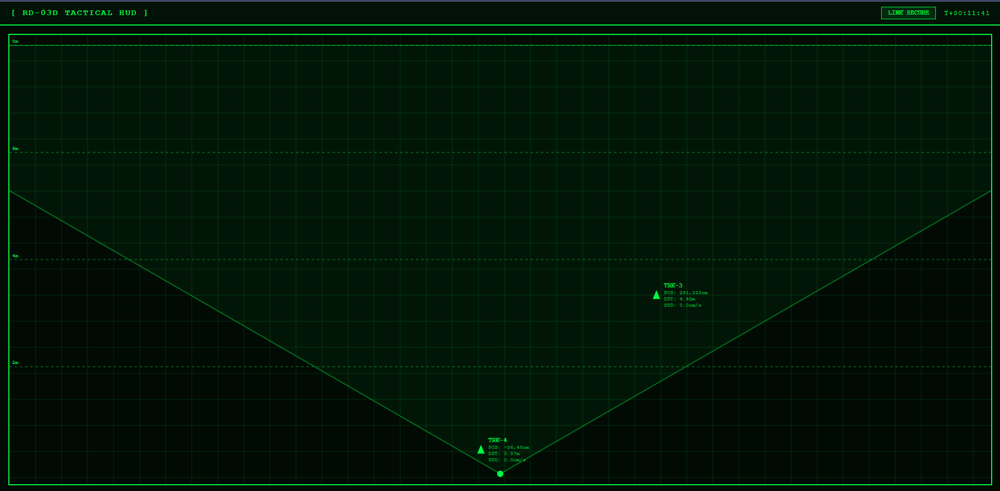

# RD-03D Tactical Radar + Web HUD

This project implements a multi-target tracking radar system using an **ESP32-C6** and an **Ai-Thinker RD-03D mmWave Radar** module. 

The application sets up the ESP32 as a WiFi Station, communicates with the radar sensor over UART to track up to 3 simultaneous targets, and serves a high-performance, real-time "Tactical HUD" web interface over HTTP and WebSockets.


*(Placeholder for Tactical HUD screenshot)*

## Features

- **Hardware**: Built for the ESP32-C6 (e.g., Seeed Studio XIAO) and the RD-03D mmWave Radar module.
- **Advanced Tracking**: Native multi-target tracking calculates distance, exact X/Y positioning, and radial velocity (speed).
- **Zero-Lag Data**: Features a hyper-responsive tracker broadcast over WebSockets at **20Hz** (every 50ms). 
- **True Vectors**: Analyzes positive/negative radial speed data to deduce target trajectories, drawing directional vector lines in the HUD.
- **Web UI**: Embedded single-page web application (`radar_ui.html`) themed as a monochromatic green display.
- **Smart Retention**: Targets that stop moving are intelligently retained as "Static" entities for up to 30 seconds before being dropped, minimizing ghosting while preserving presence.

## Requirements

- PlatformIO
- ESP-IDF Framework
- ESP32-C6 Development Board
- Ai-Thinker RD-03D Radar Module

## Wiring & Power Requirements

> [!WARNING]
> **POWER REQUIREMENT:** The RD-03D radar module strictly requires a **5V power supply** (4.5V to 5.5V range) to operate its RF circuitry properly, and draws pulsed peaks of over 200mA. 

If you are running the ESP32 strictly off a 3.7V Lithium Battery. Will not provide enough voltage, resulting in no target data.

**Battery Power Solutions:**
1. **Boost Converter:** Use MT3608 (or similar) step-up converter between your battery and the radar's `VCC` pin to boost the 3.7V up to 5.0V.
2. **USB Power Bank:** Power the ESP32 via its USB port using a standard 5V power bank, which activates the board's 5V pin.
3. **External 5V Power Supply:** Use a dedicated 5V power supply for the radar module like MB102.

### Pinout

| RD-03D Pin | ESP32-C6 Pin |
| ---------- | ------------ |
| TX         | RX (GPIO 0)  |
| RX         | TX (GPIO 1)  |
| VCC        | **5V Only**  |
| GND        | GND          |

## Configuration

1. Open `src/main.c`.
2. Update the WiFi credentials to match your local network:
   ```c
   #define WIFI_SSID "Your_SSID"
   #define WIFI_PASS "Your_PASSWORD"
   ```
3. *(Optional)* Update radar constraints like `MAX_RANGE_MM` or timeout settings in the macro definitions at the top of the file.

## Building and Flashing

This project uses PlatformIO. To build the firmware and upload it to your board:

```bash
pio run -t upload
```

Make sure the serial monitor is running to capture the ESP32's IP address once it connects to your WiFi network:

```bash
pio device monitor
```

## Usage

1. Flash the code to the ESP32-C6.
2. Open the serial monitor to view the connection progress.
3. Once connected, the ESP32 will print its IP address (e.g., `192.168.1.100`) and the mDNS hostname (`http://rd03d-radar.local`).
4. Open a web browser on any device on the same network and navigate to the IP address or the `.local` URL.
5. Ensure the radar has a clean 5V power source. You should see the Tactical HUD initializing and tracking targets in real-time.

## Project Structure

- `src/main.c`: The core C application (FreeRTOS tasks, Radar UART parsing, WebSocket server).
- `src/radar_ui.html`: The HTML/CSS/JS for the pure Tactical Web UI.
- `generate_html_header.py`: A pre-build script that embeds the HTML file as a static C header string (`radar_web_ui.h`) for deployment.
- `platformio.ini`: PlatformIO build configuration.
